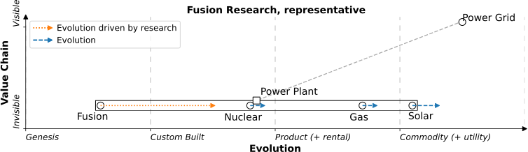
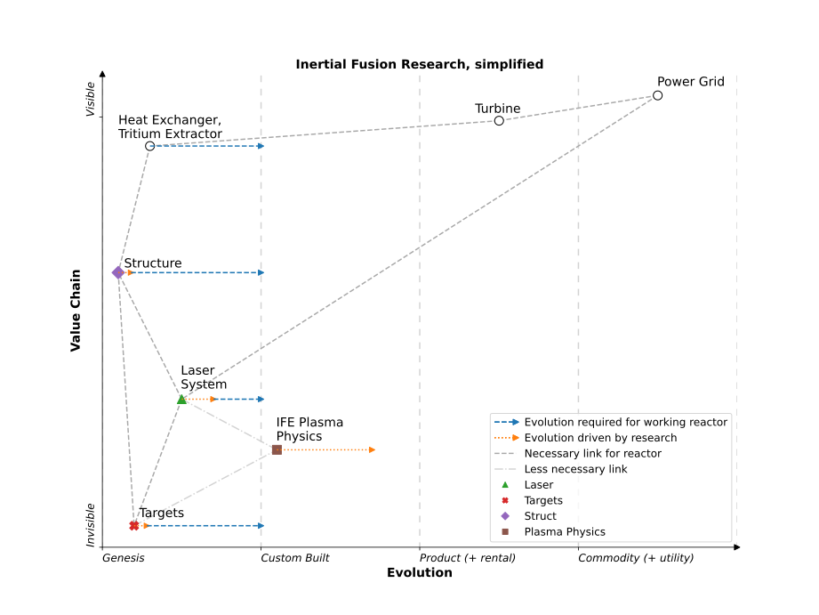

# Making Fusion Energy work with Wardley Maps!

## <small>(Or just explaining what's needed to make Fusion work)</small>

Here I draw Wardley maps, a business strategy tool, to explain what is needed to build the Fusion power plants - the different components needed, how they connect to each other, and where they are positioned to move from "genesis" to "custom built", in the first generation of power plants.

You'll need to suspend disbelief a little - in the same way there is a [Hayes Manual for the Millennium Falcon](https://www.amazon.co.uk/Millennium-Falcon-Manual-Corellian-Freighter/dp/0857330969/), this is a techincal description of something that is perpectually 50 years away.

## Fusion beyond the research

Fusion Energy is a potential source of electricity, for fuel using Lithium, from mines, and Deuterium, from seawater. It gets a lot of press, any progress often exciting! Much time and money is directed towards it - NIF, a laser fusion research experiment, cost $4 billion to build and was started 30 years ago, and many people research towards it - my own 4 year PhD included!

Less commonly discussed, once the research is completed, what else will we need? There are many components, for instance; 10, 000 fuel pellets a day, radioactive waste management, and a market exchange system for Tritium, the radioactive fuel source. These components share questions - what are these components needed to produce electricity from Fusion? How are these components connected to each other? And how far are each of the components from being workable?

And these question are answered on a Wardley Map - the components on the map and how they're connected to each other, the evolution of these components from genesis to custom built, and the information flow between the components!

## What Fusion is selling, in a Wardley map

Fusion is selling an alternative means of generating electricity, that is evolving from "genesis" to the first "custom built" fusion power plant, this evolution driven by Plasma physics research.

Using Wardley Maps, you could represent this with following (massively oversimplified) map

The component of "Power Grid" in the top right hand corner, that the consumers plug into, is therefore high on the y-axis, the value chain, and it's a very mature, standardised system, high on the "Evolution" x-axis. The "Power Grid" relies on "Power Plants", which are, to an extent, interchangeable, represented by the rectangle - in the example here, I've spread a few along the "Evolution" x-axis; Solar panels are very mature, standardised power systems, whereas conventional Nuclear plants are still built on a per-plant basis, but are becoming increasingly standardised.

In this framework, Fusion is selling another power plant; given enough research funding, Fusion power plants will "evolve" (represented by the orange arrow) from a research project (the "genesis" domain) into the first power plant (the "custom built" domain).

At the moment, though, the research isn't towards "Fusion Power plants", it's towards "Plasma Physics". So is that evolution arrow realistic? What will we need to evolve from the R&D ("genesis") into the first fucitional power plant ("custom built")? And how is it connected to the "Plasma Physics" we're researching at the moment?

## High level breakdown of a laser Fusion power plant, in a Wardley Map

Below is map representing how a laser fusion power plant might work. There are 3 key components - the structure of the power plant, the laser systems used to ignite the fuel, and the fuel itself, the targets.

A target (the fuel) is dropped into the chamber (part of the "structure"), the lasers fire, causing the target to explode, producing neutrons. These neutrons fly into the structure, are captured in an absorbtion medium (a liquid). This heats the absorption medium, this heat is extracted in the heat exchanger, used to boil some water, spin a turbine and make electricity.

This high-level map of a fusion power plant is new as far as I know - I haven't seen one before. 

Already at this high level, there are a couple of oddities; what's that "Tritium Extractor" there for, and why is it the same component as the heat exchanger?

Well, the target is made of Tritium and Deuterium, and while Deutrerium is cheap and easy to obtain from sea water, Tritium is expensive and hard to obtain. As fusion produces an excess of neutrons, part of the absorption medium is Lithium, which when hit by a neutron, produces Tritium. So part of the job the heat exchanger will also to be to extract this Tritium.

How will it do that? We don't know, I know of no substaintial research into the problem. It might easy, it might be hard, I have no idea. Spoilers - this theme repeats.

And secondly, I've labelled the link between "Plasma Phyics" and the "Laser System" as less necessary. If we built a fusion power plant that worked reliably, and we didn't understand how it worked in detail, it would still make electricity. Scientific research can be seek to understand systems that already work (planes flew before we understood compressible fluid flow), it can expand alongside systems that already work (current plane improvements are often driven by increases in scientific understand) or the systems can be applications of new scientific understanding, the science is ahead of the applications. This is a lot rarer, quantum mechanics leading to lasers say. So while building a power plant, if it happens, will follow the scientific understanding, you could argue the scientific understanding isn't required.

And as I understand Wardely maps, this the detail for a strategy conversation - you can subdivide components, but the sub-components broadly cluster around the same area on the "evolution" axis.

But because I want to describe in more detail the viability of the 

# TODO
* maps should be "Laser" fusion
