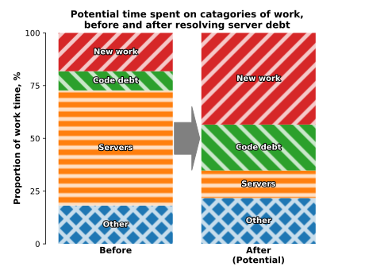

# Failing to improve dev's experience when fixing technical debt

WRITE SUMMARY

## Setting the scene

I joined a team working on an internal service. This service was a consistent bottle neck; new features took a really long time to develop, and developers didn't stay in the team beyond a year.

It turned out we spent 10% of our time developing new features, the rest fighting technical debt. The biggest single chunk, about 50% of our time, was battling with the code base; figuring out what code did what, where new code should go, fixing the multiple daily crashes, manually resuming the jobs - we couldn't restart them, as nearly all runs failed.

We fixed one chunk of the code as a proof of concept, and projected the full fix would take 3 months for the team and free up half our time.

The commercial case was clear - faster feature development, the work paying for itself in 6 months - and then more dev time, doing more rewarding work.

After a couple of months, we started our rebuild; first adding automated testing, bought in an appropriate framework, git, gitflow, CI/CD, consistent naming and code review. We deleted, rewrote, refactored and depulicated code, increased the test coverage and added automatic resume points, mitigating the damage from crashes.

And slightly under the projected 3 months, we were done.

## Results

It worked - we had fixed the tech debt in the code. Features were released more rapidly, on a more predictable caidence and the system was reliable. It was also 20% faster, a free benefit. Everyone outside the team was pleased.

And the team was initially happy, we felt more focused and productive. But this started to fade - we were now spending all our time fighting with the servers; looking for what had caused the crashes, mitigating that, relaunching the run.

As the team was no longer a bottle neck, the commercial case for tackling this wasn't there (it would have taken around another couple of months to fix
the servers).

This was really strange to me. We had been spending all our time fighting the code base, but we had fixed it. But where had all that time gone? Why were we now mostly fighting servers, even though the productivity boost occured?

## Why the dev experience remained shocking

- what's a good dev experience, in terms of tech debt
  - less that 20% of your work time managing debt?
  - perhaps a high target, but have seen it on some projects I've worked on
- main issue was inexperience
- we were naively expecting all the time we spent working on the code tech debt to turn into time working on new features
- the graph below is a visual representation of this - new feature work entirely replacing old tech debt work

- (of course the actual values are representative - each ticket is different)

- what I think actually happened was that each piece of work took half the time. Exactly what the business needed. But in terms of work spent on each feature, it just removed most of the work on code debt - the amount of time spent on each other part remained the same. So what was experienced was now, the majority of time for each feature was now spent dealing with the other sources of technical debt.

- The graph below shows what really happened - each chunk of work expanding proportionally to fill the space left by the removed tech debt.

- So we did have a large increase in the amount of time working on new features - almost double in this example, 10% to 18%. Which is of course better. But as developers, we really didn't notice it. All we noticed was we were fighting other problems, rather than code.

- So what were the other problems?
   - the servers was the problem!
   - had our own in house server farm
   - never updated
   - running different versions of software
   - dated, unsupported distributed compute software
   - a couple of the servers had flakey hardware and would crash
   - people would log onto the servers and run things on the fly, in addition to the distributed compute system, crashing things, causing unexpected changes

- Based on what we learnt above, what would happen if we fixed the severs, dealing with 90% of the worst failures?

- This was likely to take months (at least) to do properly, the servers were in a pretty dire state. In this example, approaching half of our dev time would have been spent on feature work. This would have been likely a noticable improvement, but it still less than the majority of the time, and still less than you'd aim for.

## We didn't get to fix it

- We weren't allowed to fix the servers - there were too many other people who were using it, and while our teams code could have been adapted to necessary changes, it would have cause a lot of problems to other teams
- while the commercial problem of this service being a bottleneck was removed, it didn't improve working on the system - a year later, 3 out of 4 team members had changed, consistent with the past

## Could we have got to less than 20% of our time fighting technical debt?

If it was merely solving the technical problem, perhaps if we dedicated 6 months, a year to resolving the issues, which is a huge ask from a company. But the hurdle wasn't technical - as with servers, we would have to tackle problems external to our team - issues with systems that relied on ours, or libraries we used on being unreliable. We'd have to persuade other teams to fix them, and they had their own commerical goals and targets to meet. And this would be very difficult, even if a system to introduce meaningful change was in place.

## Main takeaways

- That I was extremly naive and unrealistically optimistic about fixing tech debt
- If you're hoping to improve the experience of developers (more engaged, building and learning more rapidly, generally happier and more hopeful) and technical debt is one of the big problems, it's likely going to take a lot of work before you start seeing the developer's experience improving, even once the business benefits are really very clear - happy commercial stakeholders, and unhappy technies
- On a personal note, it taught me to be very concerned with quality of code and systems I'm working on. It is really, really important to keep your systems running well, addressing repeated pain points early. Recovery from it is going to be a lot harder than merely fixing the most painful thing, will require a lot of willing from the other people involved, as improving the situation, while not necessarily technically difficult, will likely take a lot more work than you'd think.
